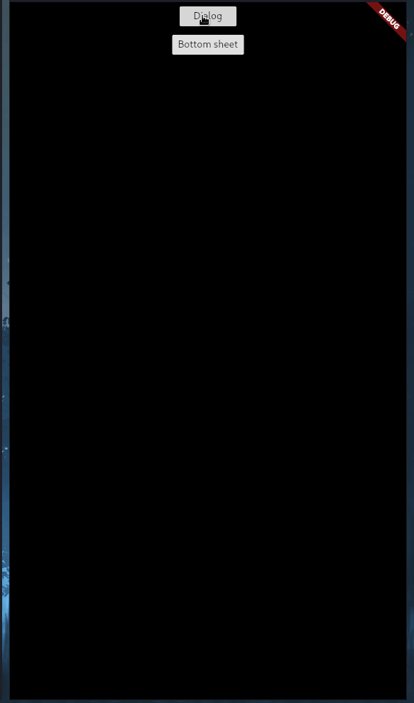

# simple_color_picker

A simple material-ish color picker for flutter.



# Example:
## AlertDialog
``` dart
showDialog(
    context: context,
    builder: (context) {
      return AlertDialog(
        contentPadding: EdgeInsets.zero,
        content: Container(
          height: MediaQuery.of(context).size.height * 0.55,
          width: MediaQuery.of(context).size.width * 0.35,
          child: SimpleColorPicker(
            height: MediaQuery.of(context).size.height * 0.55,
            onColorSelect: (color) {
              print(color);
              Navigator.of(context).pop();
            },
            onCancel: () {
              Navigator.of(context).pop();
            },
            initialColor: Color(0xffe50050),
          ),
        ),
      );
    }
```
## Modal Bottom Sheet
``` dart
showModalBottomSheet(
    context: context,
    builder: (context) {
      return SimpleColorPicker(
        height: MediaQuery.of(context).size.height * 0.55,
        onColorSelect: (color) {
          print(color);
          Navigator.of(context).pop();
        },
        onCancel: () {
          Navigator.of(context).pop();
        },
        initialColor: Color(0xffe50050),
      );
    },
),
```